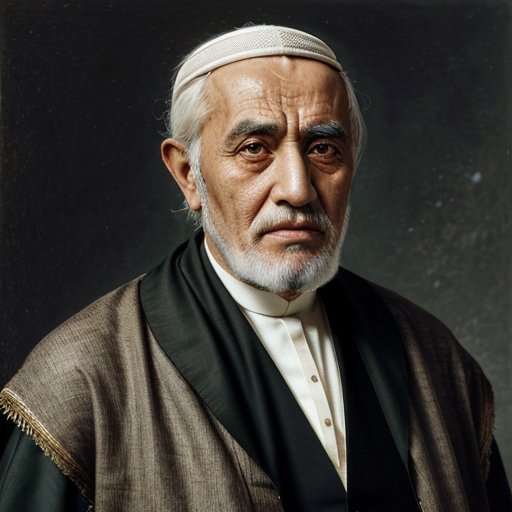

Si Abdelkader was born on October 2, 1480 (Ramadan 879 AH) in the majestic city of Alhambra, during the golden age of Andalucia. He stood at a height of 178 cm and weighed around 70 kg. His physical appearance was that of a tall, slender man with a strong jawline, piercing brown eyes, and a distinctive mole on his left cheek. 

Si Abdelkader was known for his charismatic personality, possessing a unique blend of intelligence, wisdom, and humility. He was an empathetic listener, with a calm and composed demeanor that put those around him at ease. His warm smile could light up even the most somber of occasions, making him a beloved figure among his community. 

As a scholar from Granada's intellectual haven, Si Abdelkader possessed an encyclopedic understanding of geopolitics, history, philosophy, mathematics, and astronomy. His strategic mind allowed him to navigate complex situations with ease, making him a sought-after advisor among his peers. Growing up in the vibrant city of Granada, he had been exposed to a rich tapestry of intellectual pursuits, and was well-versed in the works of Arab scholars such as Ibn Sina (Avicenna) and Ibn Rushd (Averroes), who had contributed significantly to the fields of medicine, philosophy, and astronomy. 

After the Spanish king broke his promise under the Treaty of Granada, which guaranteed the protection of the rights of worship and faith for Muslims and Jews in Andalucia, Si Abdelkader was forced to flee Granada. The Christian king's refusal to honor this treaty led to widespread persecution of Muslims and Jews, forcing many of them to leave their homes and livelihoods behind. Si Abdelkader fled due to the threats against his life and livelihood. He traveled through North Africa, eventually arriving in the Sous region, where he met his wife Lalla Zahra. Their union marked the beginning of a new chapter in their lives. 

The couple eventually settled in Mazagan (modern-day El Jadida), where they built a happy home. As a devoted husband and father, Si Abdelkader worked tirelessly to provide for his family. He became a respected member of the community in Mazagan, where he was admired for his wisdom, compassion, and generosity. The family's home became a haven for those seeking guidance and solace. His union with Lalla Zahra produced four beautiful children: Aicha, Meryem, Mohamed, and Youssef. 

Si Abdelkader left behind a lasting legacy as a devoted husband, father, and member of his community. His story serves as a testament to the resilience of the human spirit, even in the face of adversity. He demonstrated that with courage, determination, and faith, one can overcome any obstacle and build a new life. 

## Further reading

- Read More [Characters](/characters/)