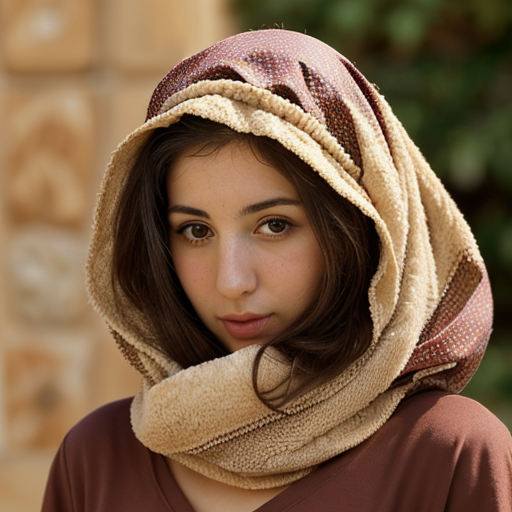

Aicha Bent Abdelkader was born on December 19, 1521, in the vibrant city of Mazagan, Morocco. At 170 cm tall and weighing 59 kg, she had a slender yet athletic build that belied her strength and resilience. 

From a young age, Aicha demonstrated a spirit of strength and determination that would serve her well as she grew into a courageous and determined warrior. 

As the youngest child of Lalla Zahra bint Mohammed and Si Abdelkader ibn Youssef, a respected noble family in the region, Aicha was raised with the values of honor, loyalty, and courage by her older siblings. Her brothers, Mohammed  and Youssef , who possessed exceptional skills in crafting and science, played an instrumental role in shaping Aicha's resourcefulness and strategic thinking. 

Aicha's natural charisma and beauty made her a perfect bait to lure high-ranking officials and soldiers from the enemy forces. Using this tactic, she gathered crucial intelligence and information that helped the resistance movement anticipate and prepare for enemy attacks. 

However, Aicha's true strength lay in her ability to think on her feet and use every available resource to outmaneuver their foes. She often employed stealthy methods to eliminate key targets, utilizing poisonous daggers crafted by her brother Youssef, drugging plants, nerve-destroying materials, and strategic signaling to other resistance fighters. 

As the leader of the underground resistance, Aicha rose through the ranks with impressive speed, earning the respect and admiration of her peers. Her cunning and bravery inspired others to join the cause, swelling the numbers of the resistance movement. 

Idir Ben Ziri, a nobleman and fellow fighter, served as a beacon of authority within the group, keeping the other warriors in check with his strong persona. His presence ensured that they respected Aicha's boundaries and treated her with the dignity she deserved. Aicha, however, was not one to be underestimated; she proved herself to be more than capable of protecting herself, and Idir had come to trust her instincts implicitly. 

Idir's love for Aicha knew no bounds; he was utterly besotted with her, going to what seemed like unreasonable lengths to ensure her safety and happiness. His devotion to her was unwavering, and he would stop at nothing to protect her from harm. This selfless behavior was deeply appreciated by Aicha herself, who loved him just as fiercely and admired his bravery, warrior spirit, and unyielding commitment to their people. 

Together, they hatched plans and executed strategies that brought them closer to their goal of liberation. In the midst of war and turmoil, Aicha's beauty and strength shone like a beacon, illuminating the path towards freedom and justice for all. Her story is one of resilience, passion, and unwavering dedication to a higher purpose – a testament to the indomitable spirit that lies within every brave and noble soul. 

## Further reading

- Read More [Characters](/characters/)