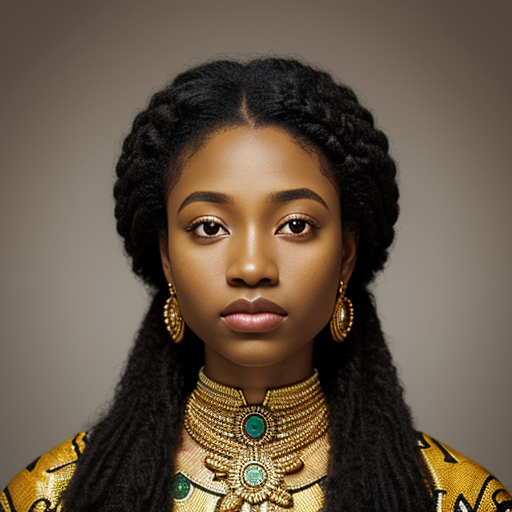

Amani m'Bemba was born on May 14, 1516, in the Kongo Kingdom. She stood at around 165 cm tall with a slender yet athletic build, weighing approximately 60 kg. Amani had a kind face with a warm smile and expressive brown eyes that sparkled with curiosity. Her long, dark hair cascaded down her back in loose waves, framing her heart-shaped face. Her African hair was a true marvel, with its rich texture and vibrant curls that seemed to spring to life whenever she moved. 

Amani's skin was a beautiful shade of chocolate, smooth and radiant, a testament to the warmth and richness of her Kongo heritage. Her dark complexion glowed with an inner light, illuminating her features and making her all the more lovely. 

She was the daughter of Mwene Nzinga, a strong and wise woman who had instilled in Amani the values of compassion, resilience, and determination that would serve her well throughout her life. Growing up surrounded by the sights and sounds of commerce, as her father, Elikia m'Bemba, was one of the most respected traders in the region. 

As Elikia's health began to decline, Amani took on a crucial role within their family business, ensuring that it continued to operate smoothly until her father's recovery. 

Amani met Mohamed ben Si Abdelkader, a young Moroccan merchant, in 1538, during one of his regular visits to her father's trading post. Their initial meeting sparked a deep connection, and they would often discuss trade agreements, negotiate prices for exotic goods, and share stories about their lives. As Amani managed the day-to-day affairs of the trading post, she and Mohamed grew closer, their friendship blossoming into a romance. 

In 1540, Elikia m'Bemba finally recovered from his illness, and Amani decided to marry Mohamed and move with him to his homeland in Morocco, specifically to the city of Mazagan (now El Jadida). As they navigated their new life together, Amani continued to apply her skills and knowledge to help establish a thriving trade business. 

The marriage brought great joy to Amani and Mohamed, and soon they welcomed three beautiful children: Ali, Zoulaikha, and Amina. Their family grew strong and loving, with Amani's warmth and Mohamed's guidance creating a harmonious home. As she adapted to her new life in Morocco, Amani found happiness in exploring the diverse culture and landscapes of the country with her husband. 

