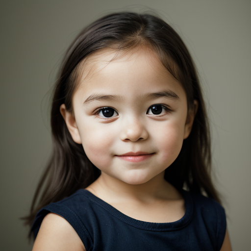

Amina bint Mohamed ben Si Abdelkader was born on December 15, 1546, to Mohamed ben Si Abdelkader and Amani bint Elikia. As the youngest child among her three siblings, Amina was a bundle of energy from the start. 

As the baby of the family, Amina was a tiny ball of mischief who loved running around the city streets with her siblings Zoulaikha and Ali. She would often get into trouble by pulling pranks on her brother Ali or stealing bits of food from her sister Zoulaikha's weaving projects. 

Despite her mischievous nature, Amina was also a sweet and affectionate child who loved being around people. She would often curl up in the lap of her mother Amani or father Mohamed, listening intently as they told stories and sang songs. 

Physically, Amina was a healthy 4-year-old girl, standing at about 99cm tall and weighing around 18kg. Her bright brown eyes sparkled with curiosity as she explored the world around her.

Amina's siblings loved her to bits, but sometimes found it challenging to keep up with her boundless energy. Zoulaikha would often try to teach Amina new skills like weaving or cooking, while Ali would take her on adventures around the city and show her all sorts of hidden treasures. 