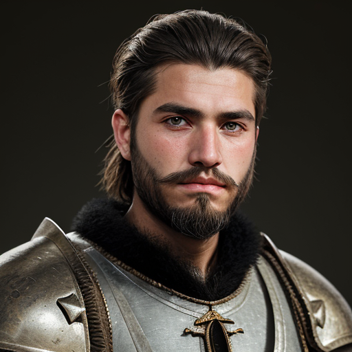

Idir Ait Ziri, a proud Amazigh warrior from the Sous region of Morocco, resides in Mazagan (modern-day El Jadida), where he shares his life with his beloved fiancée, Aicha bint Si Abdelkader. Born on March 5, 1519, he is fiercely passionate about his people, family, and especially Aicha.

Idir's love for Aicha knows no bounds; he is utterly besotted with her, going to what seems like unreasonable lengths to ensure her safety and happiness. His devotion to her is unwavering, and he will stop at nothing to protect her from harm. This selfless behavior is deeply appreciated by Aicha herself, who loves him just as fiercely and admires his bravery, warrior spirit, and unyielding commitment to their people.

As a protector of the resistance, Idir shows immense courage and fearlessness in the face of danger. His strong persona serves as a beacon of authority, keeping the other resistance warriors in check, as they are drawn to Aicha's stunning beauty. However, Idir's presence ensures that his comrades respect her boundaries and treat her with the dignity she deserves.

Aicha, however, is not one to be underestimated; she proves herself to be more than capable of protecting herself, and Idir has come to trust her instincts implicitly. While he would have concerns if she were to use herself as bait, he has faith in her abilities and knows that she can hold her own in the midst of danger.

Idir's commitment to his people and culture is evident in his traditional Amazigh warrior attire and his strong connection to the land. He stands at 182 cm tall, weighing 78 kg with a muscular build, dark curly hair, intense focused eyes, olive-toned skin with scars from battles, and strong angular features on his face.

As Aicha's trusted companion and defender, Idir is determined to ensure her safety and happiness in the midst of turmoil. His unwavering loyalty and bravery make him an indispensable part of the resistance, and together with Aicha, they form a formidable force against their common enemies.

## Key Info

-   Birthdate: March 5, 1519
-   Residence: Mazagan (modern-day El Jadida), Morocco (shared with fiancée Aicha)
-   Relationship status: Fiancé to Aicha bint Si Abdelkader
-   Personality traits:
    *    Fiercely passionate about his people and family
    *    Utterly besotted with Aicha and willing to go to great lengths for her safety and happiness
    *    Brave, fearless, and selfless in the face of danger
    *    Strong persona that keeps other resistance warriors in check
         
-   Physical appearance:
    *    Height: 182 cm
    *    Weight: 78 kg
    *    Build: Muscular
    *    Hair: Dark curly
    *    Eyes: Intense and focused
    *    Skin tone: Olive-toned with scars from battles
         
-   Abilities and strengths:
    *    Protector of the resistance
    *    Unwavering loyalty and bravery
    *    Trusts Aicha's instincts and abilities
         
-   Relationship dynamics with Aicha:
    *    Deeply in love with her
    *    Appreciates her capabilities and respects her boundaries
    *    Faithful to his commitment to protect her
         
     

## Further reading

- Read More [Characters](/characters/)