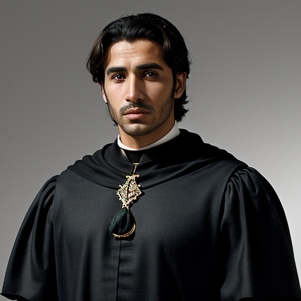

Mohamed ben Si Abdelkader was born on January 3, 1512, in Mazagan (modern-day El Jadida), Morocco. He was the eldest son of Lalla Zahra and Si Abdelkader.

Physically, Mohamed stood at 175 cm tall with a lean yet athletic build, weighing approximately 80 kg. His dark hair often wore in a neatly trimmed beard that framed his sharp facial features. His bright hazel eyes sparkled with intelligence and curiosity, reflecting his keen mind and love for learning. He had a decently fit form, neither fat nor excessively muscular, but rather well-proportioned and toned from his active lifestyle.

As the eldest child, Mohamed grew up surrounded by his siblings - Youssef, a talented craftsman; Meryem, a gifted teacher and historian; and Aicha, a spirited young woman with a passion for exploration and adventure. His mother, Lalla Zahra, took great pride in imparting her knowledge of cultural and social dynamics to him, which would later benefit him in his role as a merchant and intelligence gatherer.

Mohamed's life was marked by his intellectual curiosity and entrepreneurial spirit. He was well-versed in the art of trade, commerce, and diplomacy, skills that served him well in navigating the complexities of his time.

In 1538, Mohamed met Amani bint Elikia from the Kongo Kingdom while on a trade expedition to her homeland. Impressed by her sharp mind and commanding presence, Mohamed found himself drawn to Amani's intelligence, resilience, and mutual respect for each other's cultures. As they worked together in various business ventures, their professional relationship blossomed into a deep, mutual affection, ultimately leading to their marriage.

Mohamed's marriage to Amani from the Kongo Kingdom strengthened ties between their respective families and fostered greater understanding and cooperation between their cultures. Together, they had three children: Zoulaikha, a bright and curious child; Amina, a gentle soul with a deep love for nature and learning; and Ali, a spirited young boy with a passion for exploration.

As a father and husband, Mohamed was devoted to his family, often seeking guidance from his mother, Lalla Zahra, on matters of trade, diplomacy, and family. His relationship with his siblings remained close throughout his life, with each sibling contributing their unique skills and talents to the collective well-being of the family.

Mohamed's legacy as a merchant, leader, and husband continues to inspire generations of his family, including his sister Aicha, who would go on to have her own remarkable journey.
## Further reading

- Read More [Characters](/characters/)