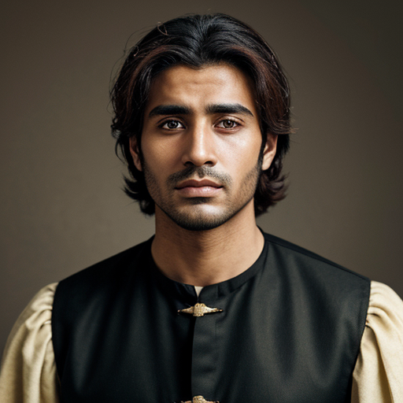

Youssef was born on March 12, 1520, in Mazagan (modern-day El Jadida), Morocco. He was the second son of Lalla Zahra and Si Abdelkader. 

Physically, Youssef stood at 170 cm tall with a lean build, weighing approximately 75 kg. His dark hair was often worn neatly trimmed, framing his sharp facial features. His bright brown eyes sparkled with creativity and ingenuity, reflecting his exceptional skills as a craftsman. 

As the second child, Youssef grew up surrounded by his siblings - Mohamed, a keen merchant and leader; Aicha, a spirited young woman who would later become the leader of underground resistance forces; and Meryem, a gifted teacher and historian. His mother, Lalla Zahra, took great pride in nurturing his creative talents from an early age. 

Meryem's influence on Youssef was significant, as she shared her vast knowledge of ancient civilizations with him. She taught him about the properties of various plants, metals, and other substances that could be used to create potent remedies or craft deadly traps. However, it was Aicha who became the linchpin between Meryem's knowledge and Youssef's skills. 

Aicha, as the leader of underground resistance forces, recognized the value of having skilled craftsmen like Youssef on her side. She would often bring him information about the materials he needed to create his tools and creations, which Mohamed would procure through his extensive commerce network. Mohamed, with his connections in other parts of Africa, was able to acquire rare metals, woods, and other materials that were essential for Youssef's craft. 

Youssef, meanwhile, worked tirelessly to develop his skills as a master craftsman. He used Meryem's knowledge to create tools and creations that would aid the resistance forces in their fight against their oppressors. His expertise in metallurgy, herbology, and engineering enabled him to design daggers for stealth and precision, poison and herbal remedies for close combat, and intricate traps for taking down opponents silently. 

As a master craftsman, Youssef's work was often done in secret, as he carefully balanced his life as an artisan with his involvement in the resistance. His contributions were invaluable, providing the means for the guerilla fighters to fight back against their oppressors. Aicha would coordinate with Youssef to ensure that his creations reached the right hands at the right time, while Mohamed's commerce network continued to supply them with the materials they needed. 

In this way, Youssef played a crucial role in the resistance movement, using his skills as a craftsman to create tools and creations that would aid the fighters on the ground. His work was a testament to the power of collaboration and cooperation between individuals from different backgrounds and skill sets, all working together towards a common goal. 

## Further reading

- Read More [Characters](/characters/)
