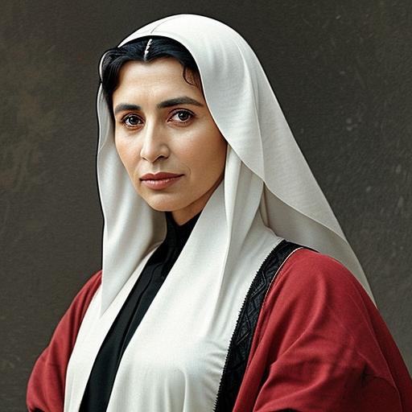

Lalla Zahra, a revered woman from Morocco, was born on February 15, 1495, in the Sous region, a place known for its rich cultural heritage. However, she spent most of her life in Mazagan (modern-day El Jadida), where she grew up surrounded by the values of honor, loyalty, and compassion instilled in her by her family.

As the daughter of El Mahdi, a respected leader of their tribe and one of the nobles of the region, Lalla Zahra's upbringing was marked by a deep understanding of social dynamics and cultural nuances. Growing to an impressive height of 165 cm, with a sturdy build and weighing around 60 kg, she possessed a strong yet gentle presence that commanded respect from all who knew her. Her dark hair was often styled in a traditional manner, adorned with intricate braids and adornments that reflected her cultural heritage.

As the wife of Si Abdelkader and mother of four children - Mohammed, Youssef, Meryem, and Aicha - Lalla Zahra is a pillar of strength within her family. She embodies the qualities of wisdom, resilience, and compassion, which have earned her great respect from her loved ones. Her eldest son, Mohammed, benefits greatly from her insights into cultural and social dynamics, allowing him to excel in his role as a merchant and intelligence gatherer. Youssef, her craftsman son, receives knowledge of traditional techniques and herbal remedies that enhance his work, while Meryem, the teacher and historian, is inspired by her mother's dedication to cultural preservation. Aicha, the warrior, draws strength from her mother's resilience and wisdom.

Lalla Zahra's personality shines through in the way she nurtures her children and grandchildren. Her gentle touch, soothing voice, and unwavering optimism inspire confidence and reassurance, creating a sense of safety that allows them to grow and thrive. As the grandmother of Amina, Zoulaikha, and Ali (children of Mohammed), Lalla Zahra delights in sharing stories of her own childhood, passing down valuable lessons and traditions that have been passed down through generations.

When Mohammed and his wife Amani, who hails from the Kongo Kingdom, would travel to their home country for business, Lalla Zahra would take on the role of devoted caregiver to their children. She would lovingly care for them, regaling them with tales of adventure, sharing wisdom gained from her own life experiences, and creating a sense of stability amidst the uncertainty.

Lalla Zahra's influence extends beyond her immediate family. Her father, El Mahdi, instilled in her the importance of community service, social responsibility, and compassion. She has carried this legacy forward, becoming an exemplary role model for her children and grandchildren. As they grow into capable leaders, Lalla Zahra's guidance continues to inspire them, shaping their values and character.

Throughout her life, Lalla Zahra remains a beacon of hope and resilience, inspiring those around her with her unwavering optimism, kindness, and generosity. Her story is a testament to the enduring power of love, family, and community.
## Further reading

- Read More [Characters](/characters/)
